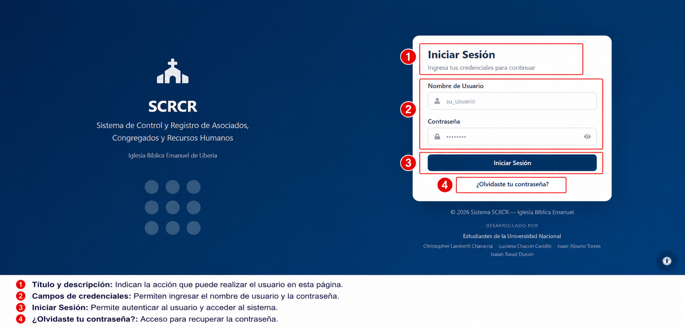

# Acceso al Sistema

El módulo de **Inicio de sesión** es el punto de entrada al SCRCR. Aquí el usuario valida su identidad y accede a las funcionalidades autorizadas.

## Pasos para ingresar

1. Abrir la aplicación SCRCR.
2. Introducir el nombre de usuario o correo electrónico.
3. Escribir la contraseña asignada.
4. Hacer clic en el botón **Iniciar sesión**.

## Recomendaciones

1. Mantén tus credenciales en un lugar seguro.
2. No compartas tu contraseña con terceros.
3. Si olvidas tu contraseña, solicita recuperación al administrador.

## Indicadores de estado

- Si el acceso es correcto, se mostrará la pantalla principal del sistema.
- Si el acceso falla, el sistema mostrará un mensaje claro y sugerirá verificar los datos.

## Consejos de uso

1. Verifica que tu usuario sea el correcto antes de ingresar.
2. Cierra sesión cuando termines tu jornada de trabajo.
3. Usa una contraseña fuerte y única.
