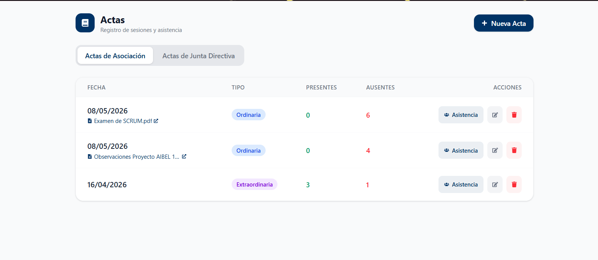
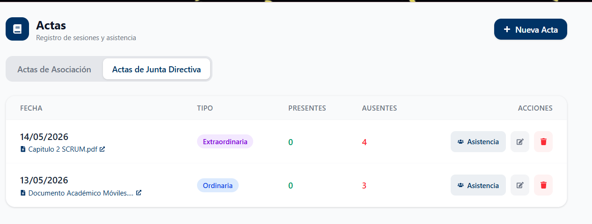
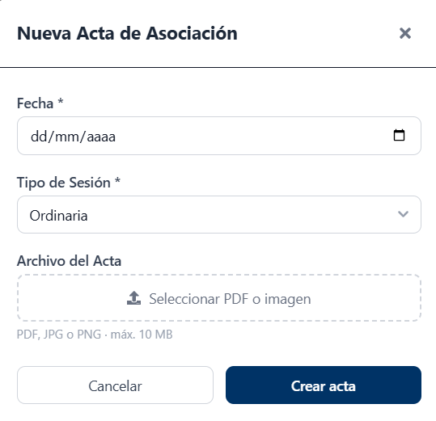
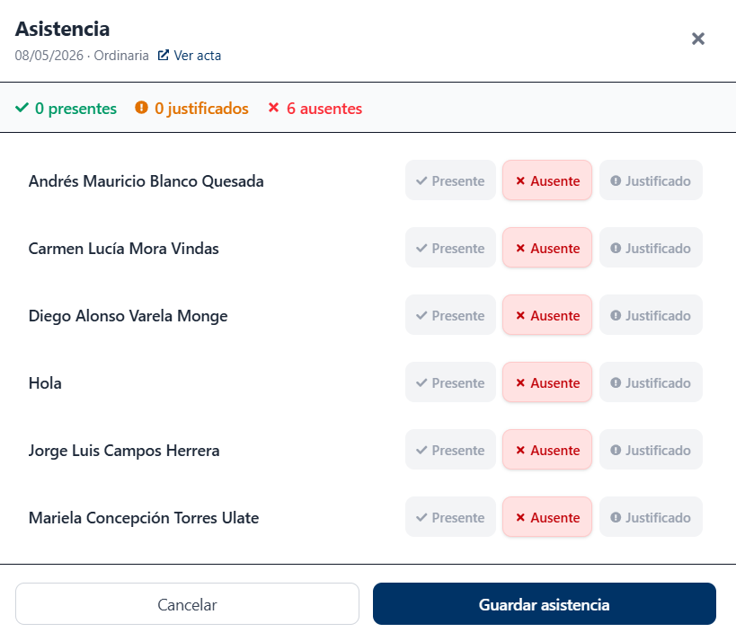
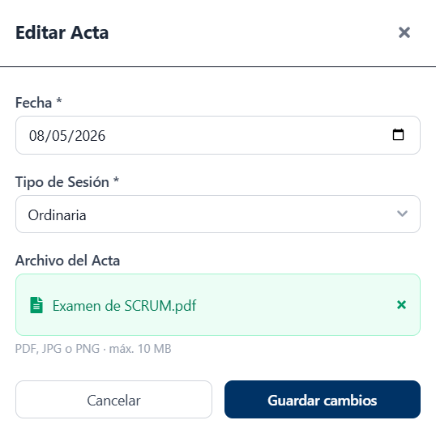

# Actas

## Descripción

El módulo Actas permite registrar sesiones de asociación y junta directiva, adjuntar documentos de respaldo y controlar la asistencia de los participantes.

## Funcionalidades Principales

- Registrar nuevas actas.
- Consultar actas registradas.
- Adjuntar documentos PDF o imágenes.
- Editar información de actas existentes.
- Eliminar actas.
- Registrar asistencia.
- Gestionar actas de Asociación.
- Gestionar actas de Junta Directiva.

## Tipos de Actas

El sistema permite administrar dos categorías:

- Actas de Asociación.
- Actas de Junta Directiva.

## Registrar Acta

Para crear una nueva acta, seleccione la opción **Nueva Acta**.

### Información requerida

- Fecha (*)
- Tipo de sesión (*)
- Archivo del acta (opcional)

El sistema permite adjuntar archivos en formato:

- PDF
- JPG
- PNG

!!! note
    Los campos marcados con un asterisco (*) son obligatorios para registrar el acta.

Una vez completada la información, presione **Crear acta**.

## Registro de Asistencia

Cada acta permite registrar la asistencia de los participantes relacionados con la sesión.

Para cada participante se puede indicar uno de los siguientes estados:

- Presente
- Ausente
- Justificado

El sistema actualiza automáticamente los totales de asistencia mostrados en la parte superior de la ventana.

## Editar Acta

Para modificar una acta existente, seleccione la opción **Editar** desde el listado principal.

Puede actualizar:

- Fecha de la sesión.
- Tipo de sesión.
- Archivo adjunto.

Finalmente, presione **Guardar cambios** para actualizar la información.

## Gestión de Documentos

Las actas pueden incluir documentos de respaldo para consulta posterior.

Los documentos adjuntos pueden visualizarse directamente desde el listado de actas mediante el enlace correspondiente.

!!! note
    Las acciones disponibles pueden variar según el rol asignado al usuario.