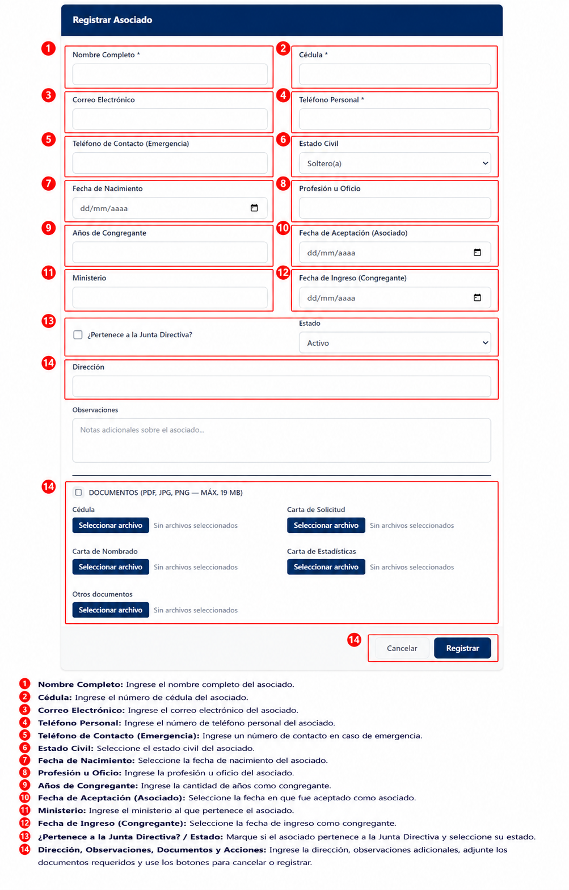
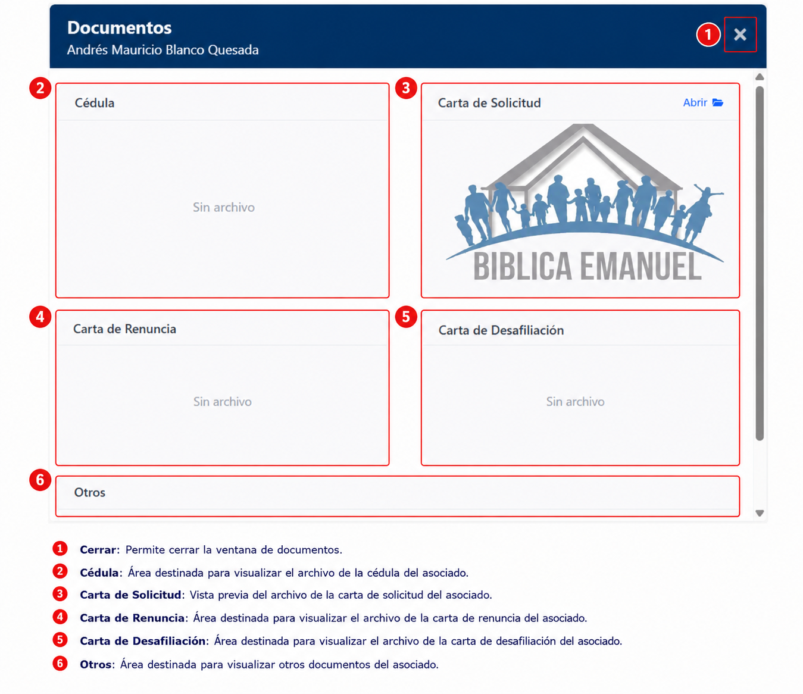
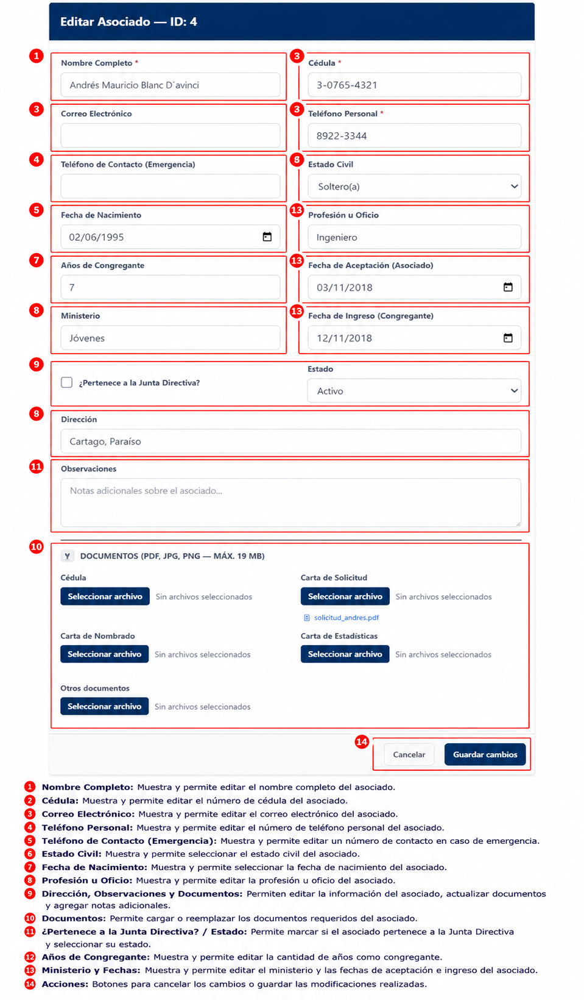

# Listado de Asociados

## Descripción

El módulo Listado de Asociados permite consultar, buscar y administrar la información de los asociados registrados en el sistema.

## Secciones clave del módulo

1. **Título y descripción:** indica en qué sección estás y cuál es su función.
2. **Acciones principales:** botones para plantilla, importar, exportar a Excel/PDF y crear un nuevo asociado.
3. **Filtros de búsqueda:** permite buscar por nombre, cédula y estado.
4. **Limpiar y recargar:** limpia los filtros y actualiza los resultados.
5. **Total de resultados:** muestra la cantidad de registros encontrados.
6. **Filas por página:** permite seleccionar cuántos registros se muestran.
7. **Encabezados de columna:** muestran la información disponible en la tabla.
8. **Tabla de resultados:** lista los asociados con opciones de acción por registro.

## Funcionalidades principales

- Consultar asociados registrados.
- Buscar asociados por nombre, cédula o estado.
- Filtrar por estado.
- Exportar información a Excel.
- Exportar información a PDF.
- Registrar nuevos asociados.
- Editar información existente.
- Activar asociados inactivos.

## Uso del módulo

1. Ingrese los criterios de búsqueda en los filtros disponibles.
2. Presione **Recargar** para actualizar los resultados.
3. Use **Limpiar** para volver a mostrar todos los registros.
4. Seleccione **Excel** o **PDF** para exportar la lista.
5. Presione **Nuevo** para abrir el formulario y registrar un asociado.
6. En la tabla, use **Editar** o **Docs** para administrar cada registro.

## Registrar Asociado

Para registrar un nuevo asociado, haga clic en **Nuevo** desde el listado de asociados.

### Pasos para registrar un asociado

1. Complete los datos del formulario principal.
2. Adjunte los documentos requeridos.
3. Presione **Registrar** para guardar el registro.

### Campos del formulario de registro

1. **Nombre Completo**: Ingrese el nombre completo del asociado.
2. **Cédula**: Ingrese el número de cédula del asociado.
3. **Correo Electrónico**: Ingrese el correo electrónico del asociado.
4. **Teléfono Personal**: Ingrese el número de teléfono personal del asociado.
5. **Teléfono de Contacto (Emergencia)**: Ingrese un número de contacto para emergencias.
6. **Estado Civil**: Seleccione el estado civil del asociado.
7. **Fecha de Nacimiento**: Seleccione la fecha de nacimiento del asociado.
8. **Profesión u Oficio**: Ingrese la profesión u oficio del asociado.
9. **Años de Congregante**: Ingrese la cantidad de años como congregante.
10. **Fecha de Aceptación (Asociado)**: Seleccione la fecha en que fue aceptado como asociado.
11. **Ministerio**: Ingrese el ministerio al que pertenece el asociado.
12. **Fecha de Ingreso (Congregante)**: Seleccione la fecha de ingreso como congregante.
13. **¿Pertenece a la Junta Directiva? / Estado**: Marque si pertenece a la Junta Directiva y seleccione su estado.
14. **Dirección**: Ingrese la dirección del asociado.

### Documentos del asociado

15. **Documentos admitidos**: PDF, JPG o PNG, máximo 19 MB.

Adjunte los siguientes documentos según corresponda:

- **Cédula**
- **Carta de Solicitud**
- **Carta de Nombrado**
- **Carta de Estadísticas**
- **Otros documentos**

Use los botones **Seleccionar archivo** para cargar cada documento y luego presione **Registrar**.

### Botones de acción

- **Cancelar**: Cierra el formulario sin guardar cambios.
- **Registrar**: Guarda el nuevo asociado en el sistema.

!!! note
    Verifique que los datos ingresados sean correctos antes de finalizar el registro.

## Visualizar documentos adjuntos

Para revisar los documentos que ya fueron cargados para un asociado, abra la opción **Docs** desde el listado de asociados.

En esta ventana puede ver los archivos guardados para el asociado:

- Cédula
- Carta de solicitud
- Carta de renuncia
- Carta de desafiliación
- Otros documentos

## Editar Asociado

Para modificar la información de un asociado, seleccione **Editar** desde el listado principal.

Actualice los datos necesarios y luego presione **Guardar cambios**.

!!! NOTA:
    Los campos marcados con un asterisco (*) son obligatorios y deben completarse para poder registrar o actualizar la información del asociado.
