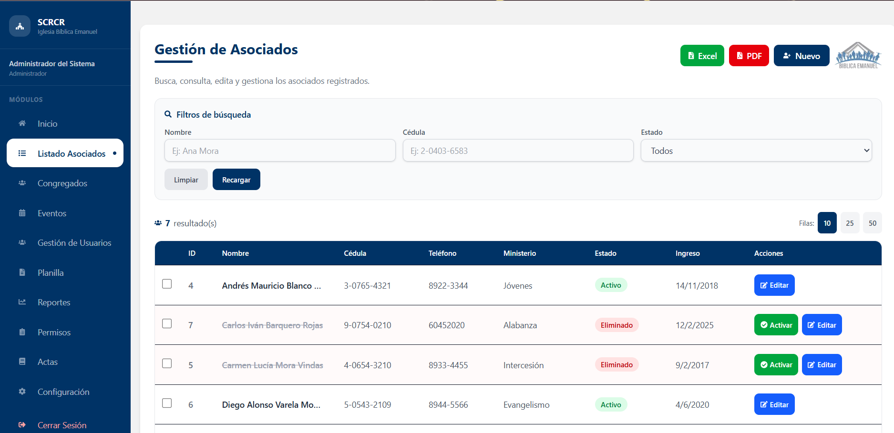
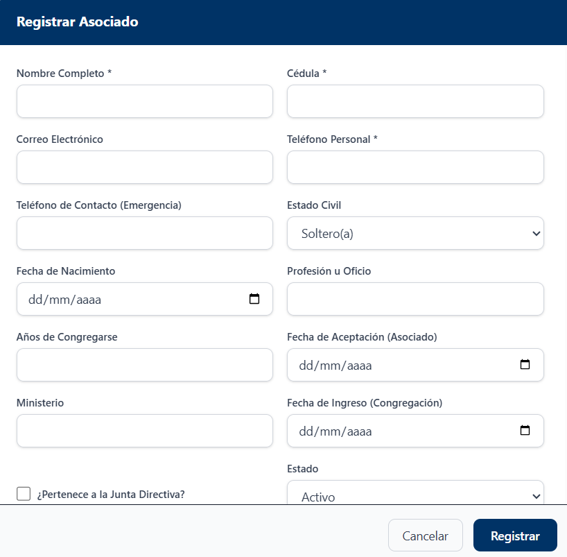
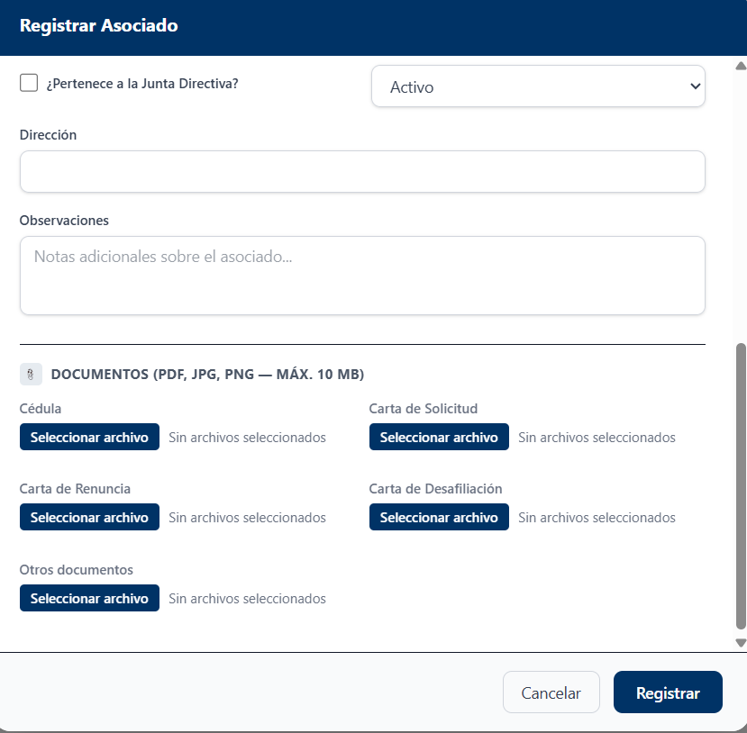
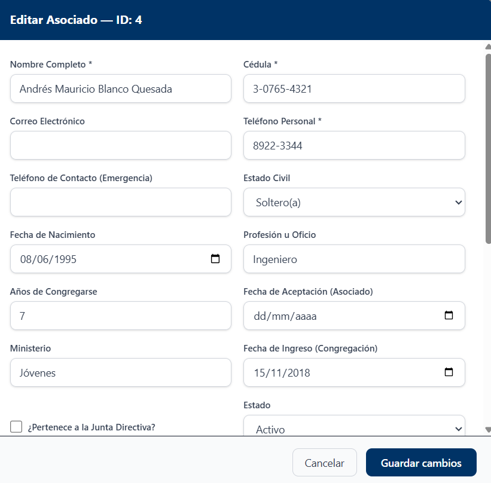
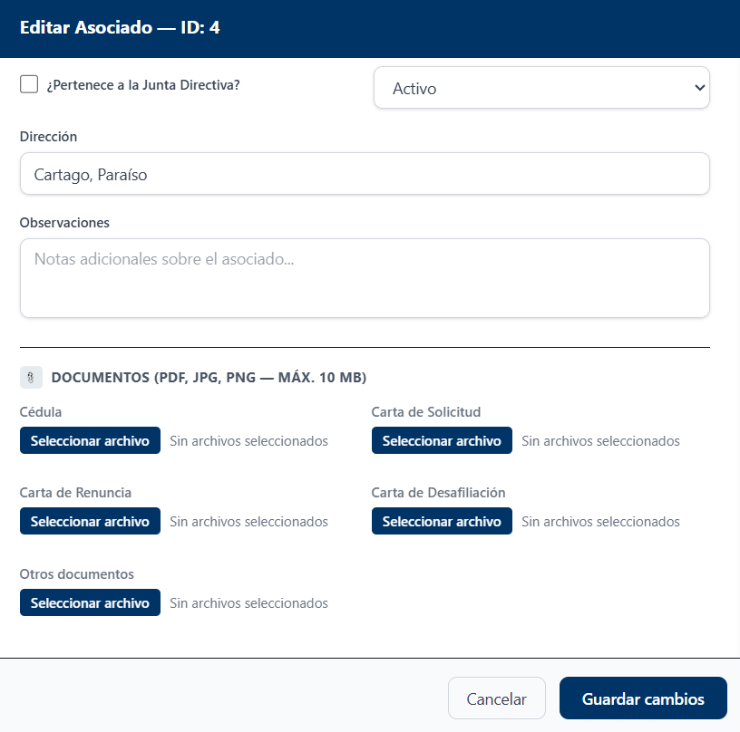

# Listado de Asociados

## Descripción

El módulo Listado de Asociados permite consultar, buscar y administrar la información de los asociados registrados en el sistema.

## Funcionalidades Principales

- Consultar asociados registrados.
- Buscar asociados por nombre, cédula o estado.
- Exportar información a Excel.
- Exportar información a PDF.
- Registrar nuevos asociados.
- Editar información existente.
- Activar asociados inactivos.

## Uso del módulo

1. Ingrese los criterios de búsqueda en los filtros disponibles.
2. Presione **Recargar** para actualizar la información.
3. Utilice los botones **Excel** o **PDF** para exportar los datos.
4. Seleccione **Nuevo** para registrar un asociado.
5. Utilice las acciones disponibles para editar o activar registros.

## Registrar Asociado

Para registrar un nuevo asociado, seleccione la opción **Nuevo** desde el listado de asociados.

### Información General

Complete la información personal, de contacto y los datos relacionados con la congregación.

### Documentación y Registro

Adjunte la documentación requerida y presione **Registrar** para guardar la información.

!!! note
    Verifique que los datos ingresados sean correctos antes de finalizar el registro.
## Editar Asociado

Para modificar la información de un asociado, seleccione la opción Editar desde el listado principal.

Complete o modifique los datos requeridos.

Finalmente, presione Guardar cambios para actualizar la información.

!!! note
Los campos marcados con un asterisco (*) son obligatorios y deben completarse para poder registrar o actualizar la información del asociado.
