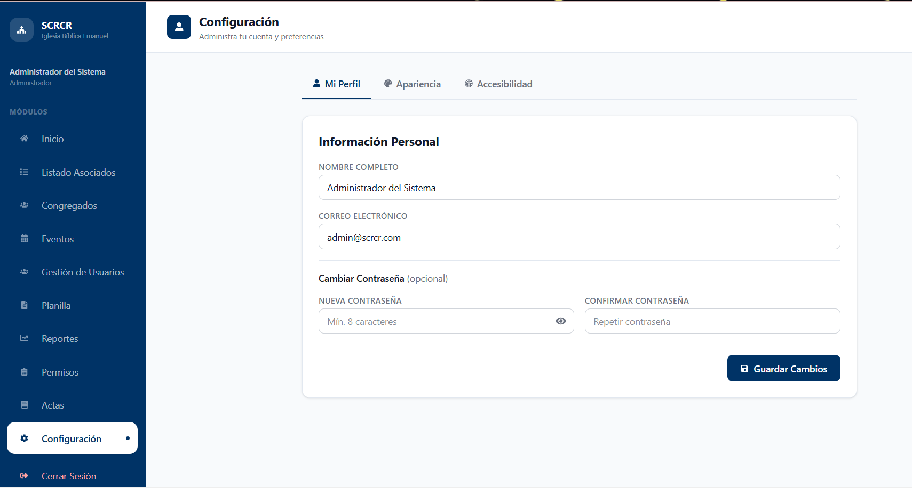
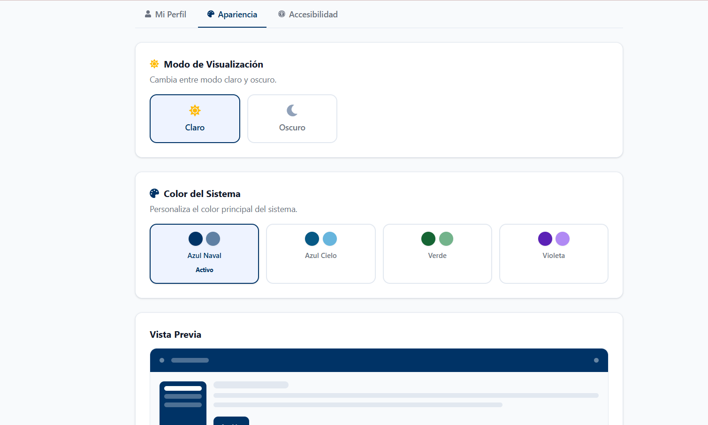
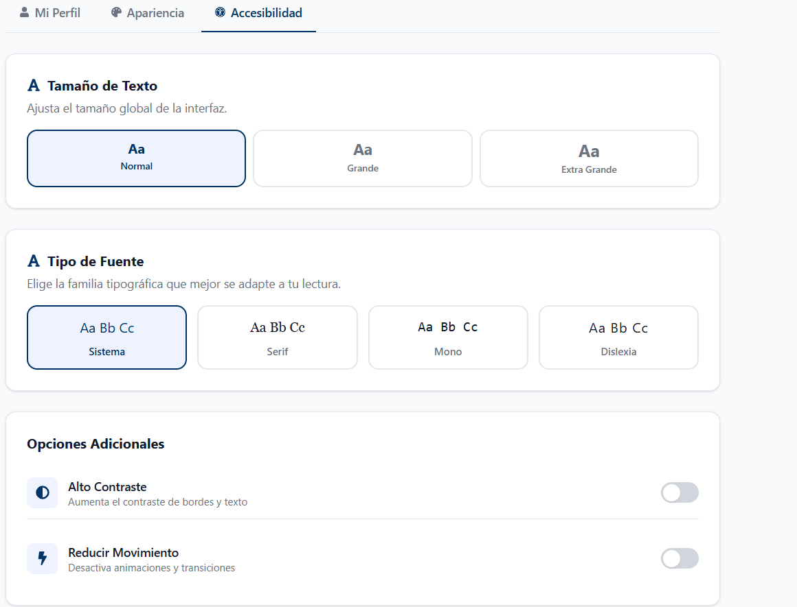

# Configuración

## Descripción

El módulo Configuración permite personalizar la experiencia de uso del sistema, administrar la información del perfil y ajustar opciones de accesibilidad.

## Funcionalidades Principales

- Actualizar información del perfil.
- Cambiar contraseña.
- Personalizar la apariencia del sistema.
- Seleccionar modo de visualización.
- Cambiar colores del sistema.
- Ajustar opciones de accesibilidad.
- Modificar tamaño y tipo de fuente.

---

# Mi Perfil

La pestaña **Mi Perfil** permite administrar la información personal del usuario.

### Información disponible

- Nombre completo.
- Correo electrónico.
- Cambio de contraseña.

### Cambio de contraseña

Para actualizar la contraseña:

1. Ingrese la nueva contraseña.
2. Confirme la contraseña.
3. Presione **Guardar Cambios**.

!!! note
    La contraseña debe cumplir con los requisitos de seguridad definidos por el sistema.

---

# Apariencia

La pestaña **Apariencia** permite personalizar la presentación visual del sistema.

## Modo de Visualización

El sistema permite seleccionar entre:

- Modo Claro.
- Modo Oscuro.

## Color del Sistema

Se puede elegir uno de los temas disponibles:

- Azul Naval.
- Azul Cielo.
- Verde.
- Violeta.

El sistema muestra una vista previa de los cambios antes de aplicarlos.

---

# Accesibilidad

La pestaña **Accesibilidad** proporciona herramientas para mejorar la experiencia de uso de acuerdo con las necesidades del usuario.

## Tamaño de Texto

Las opciones disponibles son:

- Normal.
- Grande.
- Extra Grande.

## Tipo de Fuente

El sistema permite seleccionar:

- Sistema.
- Serif.
- Mono.
- Dislexia.

## Opciones Adicionales

### Alto Contraste

Incrementa el contraste visual de textos y componentes de la interfaz.

### Reducir Movimiento

Disminuye o elimina animaciones y transiciones visuales.

!!! note
    Los cambios realizados en apariencia y accesibilidad se aplican automáticamente al sistema.