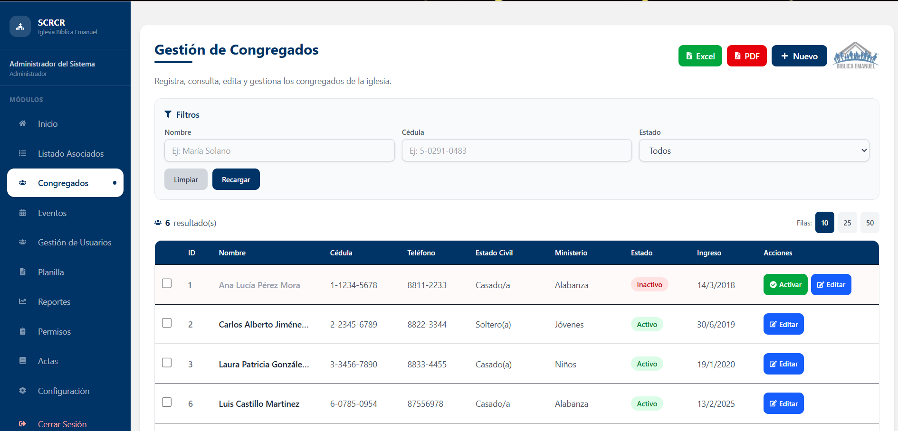
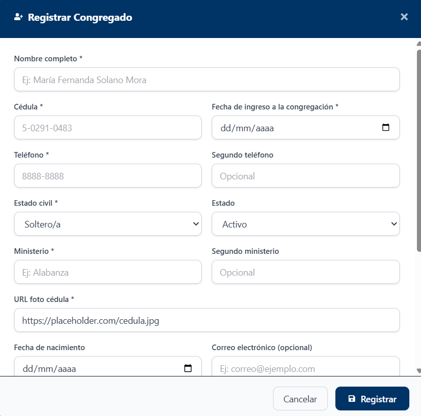
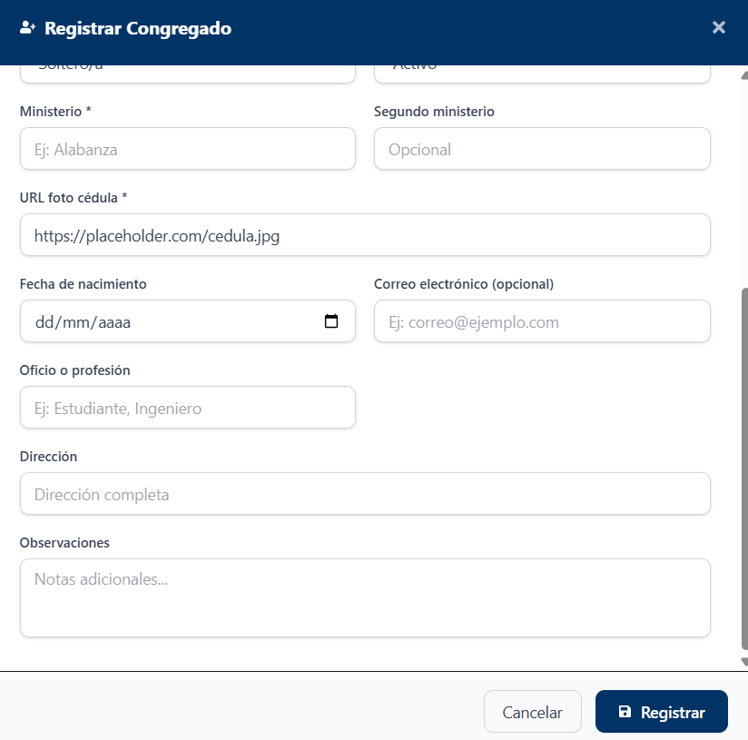
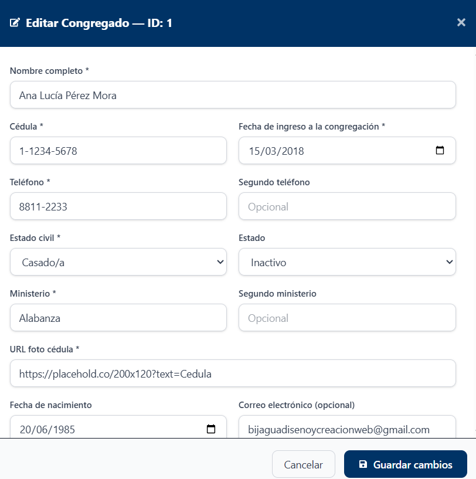
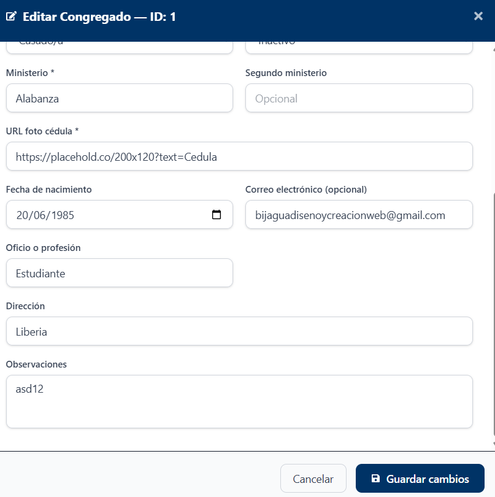

# Congregados

## Descripción

El módulo Congregados permite registrar, consultar y administrar la información de los miembros congregados de la iglesia.

## Funcionalidades Principales

* Consultar congregados registrados.
* Buscar congregados por nombre, cédula o estado.
* Exportar información a Excel.
* Exportar información a PDF.
* Registrar nuevos congregados.
* Editar información existente.
* Activar congregados inactivos.

## Uso del módulo

1. Ingrese los criterios de búsqueda en los filtros disponibles.
2. Presione **Recargar** para actualizar la información.
3. Utilice los botones **Excel** o **PDF** para exportar los datos.
4. Seleccione **Nuevo** para registrar un congregado.
5. Utilice las acciones disponibles para editar o activar registros.

## Registrar Congregado

Para registrar un nuevo congregado, seleccione la opción **Nuevo** desde el listado de congregados.

### Información General

!!! note
Los campos marcados con un asterisco (*) son obligatorios y deben completarse para poder registrar la información del congregado.

Complete la información personal, de contacto y los datos relacionados con la congregación.

### Información Complementaria

Ingrese la información adicional correspondiente, incluyendo dirección, observaciones y demás datos complementarios.

Finalmente, presione **Registrar** para guardar la información.

## Editar Congregado

Para modificar la información de un congregado, seleccione la opción **Editar** desde el listado principal.

### Modificación de Datos

Actualice la información requerida según corresponda.

### Información Complementaria

Realice los cambios necesarios y presione **Guardar cambios** para actualizar la información.

!!! note
Los campos marcados con un asterisco (*) son obligatorios. Si alguno de estos campos se encuentra vacío, el sistema no permitirá guardar los cambios realizados.

!!! note
Los permisos disponibles pueden variar según el rol asignado al usuario.
