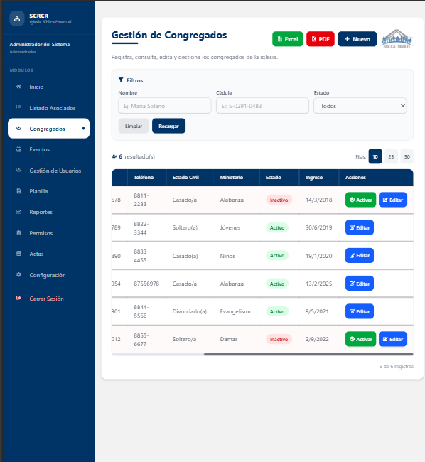

# Congregados

El módulo de **Congregados** está enfocado en la gestión de los miembros de la congregación. Permite registrar su participación y mantener sus datos actualizados.

## Funciones principales

1. Registrar nuevos congregados.
2. Consultar listas de congregados.
3. Actualizar información de contacto y estado.
4. Generar listados por grupo o actividad.

## Cómo usarlo

1. Ingresa al módulo **Congregados** desde el menú.
2. Selecciona el grupo o categoría para filtrar los registros.
3. Busca por nombre, documento o estado.
4. Para editar un congregado, abre su ficha y modifica los campos necesarios.

## Recomendaciones

- Verifica que los datos personales sean completos.
- Actualiza el estado de asistencia o participación según corresponda.
- Usa los filtros para gestionar grupos específicos.

## Buenas prácticas

1. Revisa periódicamente la lista de congregados activos.
2. Registra cambios de residencia o contacto tan pronto como ocurran.
3. Utiliza la clasificación por grupos para organizar mejor la información.
