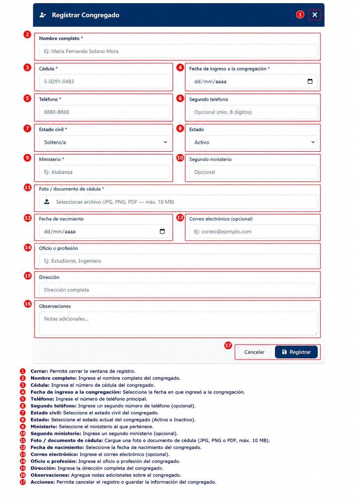
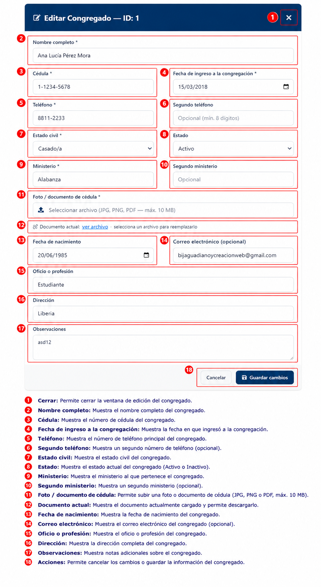
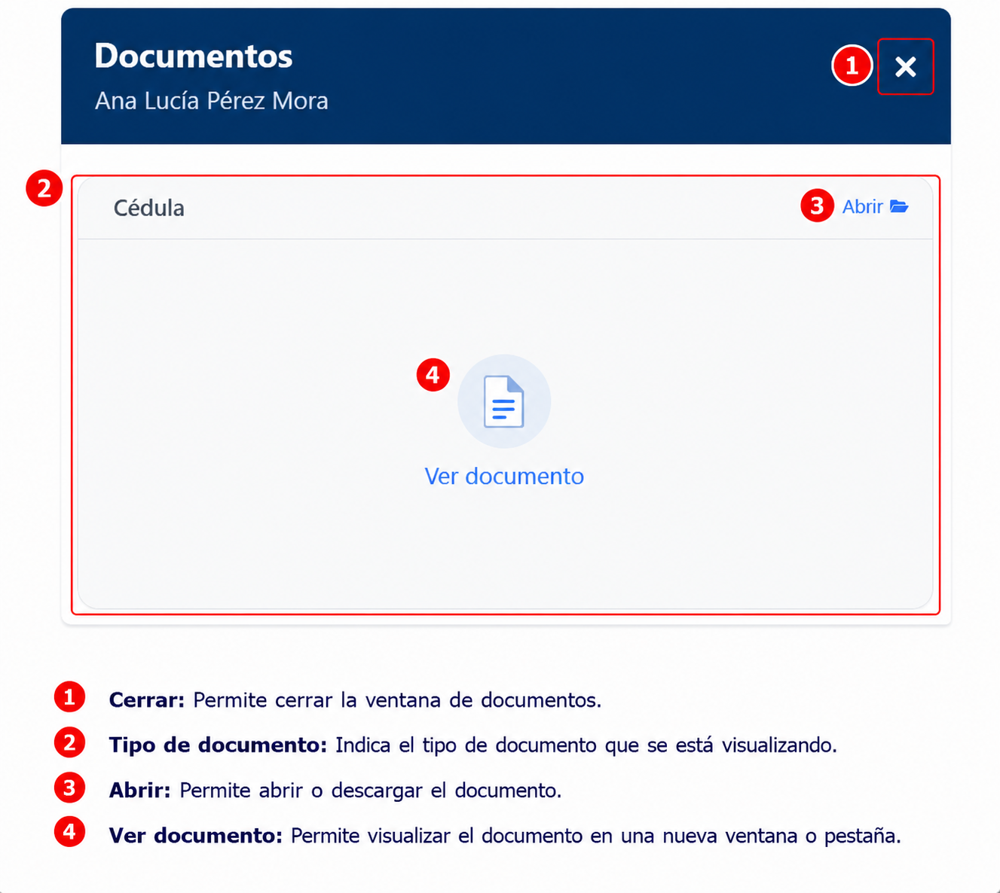

# Congregados

## Descripción

El módulo Congregados permite registrar, consultar y administrar la información de los miembros congregados de la iglesia.

## Funcionalidades principales

- Consultar congregados registrados.
- Buscar congregados por nombre, cédula o estado.
- Filtrar registros por estado.
- Exportar información a Excel y PDF.
- Registrar nuevos congregados.
- Editar información existente.
- Activar congregados inactivos.

## Uso del módulo

1. Ingrese los criterios de búsqueda en los filtros disponibles.
2. Presione **Recargar** para actualizar los resultados.
3. Use **Limpiar** para restablecer los filtros.
4. Seleccione **Excel** o **PDF** para exportar la lista.
5. Presione **Nuevo** para abrir el formulario de registro.
6. Use **Editar** o **Docs** en la tabla para administrar cada registro.

## Registrar Congregado

Para registrar un nuevo congregado, haga clic en **Nuevo** desde el listado.

### Campos del formulario

- **Nombre completo**
- **Cédula**
- **Fecha de ingreso a la congregación**
- **Teléfono**
- **Segundo teléfono** (opcional)
- **Estado civil**
- **Estado** (Activo / Inactivo)
- **Ministerio**
- **Segundo ministerio** (opcional)
- **Foto/documento de cédula** (JPG, PNG, PDF, máx. 10 MB)
- **Fecha de nacimiento**
- **Correo electrónico** (opcional)
- **Oficio o profesión**
- **Dirección**
- **Observaciones**

### Acciones del registro

- **Cancelar**: Cierra la ventana de registro.
- **Registrar**: Guarda el nuevo congregado en el sistema.

!!! NOTA

    Los campos marcados con un asterisco (*) son obligatorios y deben completarse para registrar la información del congregado.

## Editar Congregado

Para modificar la información de un congregado, seleccione **Editar** desde el listado principal.

### Qué puede cambiar

- Nombre completo
- Cédula
- Fecha de ingreso a la congregación
- Teléfono y segundo teléfono
- Estado civil
- Estado (Activo / Inactivo)
- Ministerio y segundo ministerio
- Foto/documento de cédula
- Fecha de nacimiento
- Correo electrónico
- Oficio o profesión
- Dirección
- Observaciones

### Acciones de edición

- **Cancelar**: Deshace los cambios y cierra la ventana.
- **Guardar cambios**: Actualiza la información del congregado.

!!! NOTA

    Los campos marcados con un asterisco (*) son obligatorios. Si alguno está vacío, el sistema no permitirá guardar los cambios.

## Visualizar documentos de un congregado

Para revisar los documentos adjuntos, seleccione **Docs** desde la lista de congregados.

