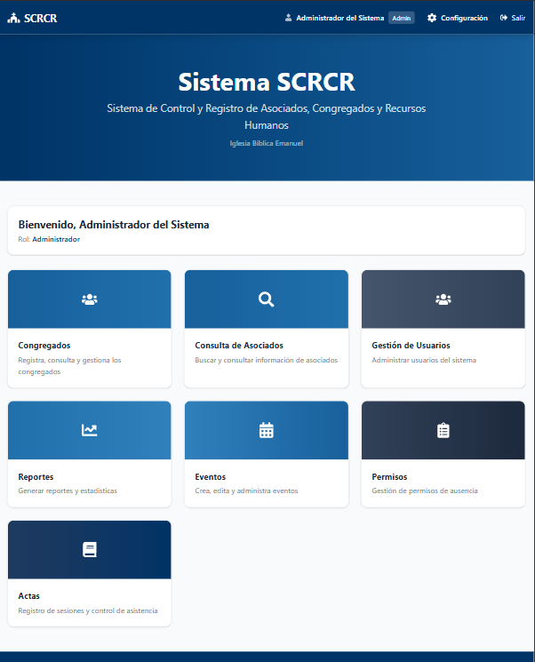

# Menú Principal

Esta es la pantalla principal del SCRCR. Desde aquí el usuario puede navegar por los módulos del sistema según los permisos asignados.

## Objetivo

Brindar una visión clara de los módulos disponibles y facilitar el acceso rápido a las funciones principales.

## Módulos del menú principal

### Inicio
Muestra la bienvenida, notificaciones generales y accesos rápidos a las funciones más utilizadas.

### Listado de Asociados
Permite consultar y buscar asociados registrados en el sistema.

### Congregados
Brinda acceso a la gestión de los congregados y su información de participación.

### Eventos
Facilita la administración de actividades, eventos y el control de asistencia.

### Gestión de Usuarios
Permite crear usuarios, asignar roles, editar datos y controlar accesos.

### Planilla
Ofrece la consulta de pagos y el seguimiento de los procesos administrativos del personal.

### Reportes
Genera resúmenes e informes para apoyar la toma de decisiones.

### Permisos
Permite revisar y gestionar autorizaciones relacionadas con ausencias y permisos especiales.

### Actas
Facilita el registro de reuniones, acuerdos y observaciones oficiales.

### Configuración
Ofrece opciones para ajustar parámetros generales del sistema y personalizar el entorno.

### Cerrar Sesión
Finaliza la sesión activa y protege el acceso al sistema.

!!! Note
    Las opciones visibles en el menú principal dependen del rol y los permisos asignados a cada usuario.
