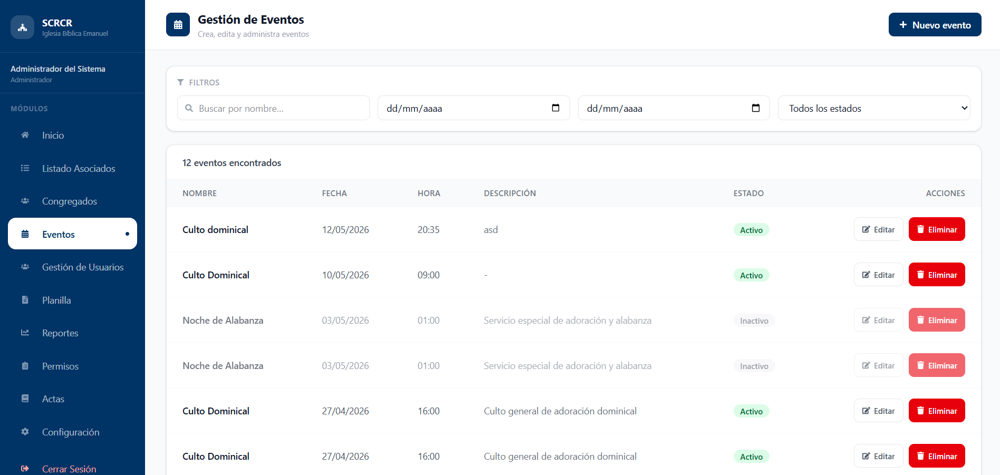
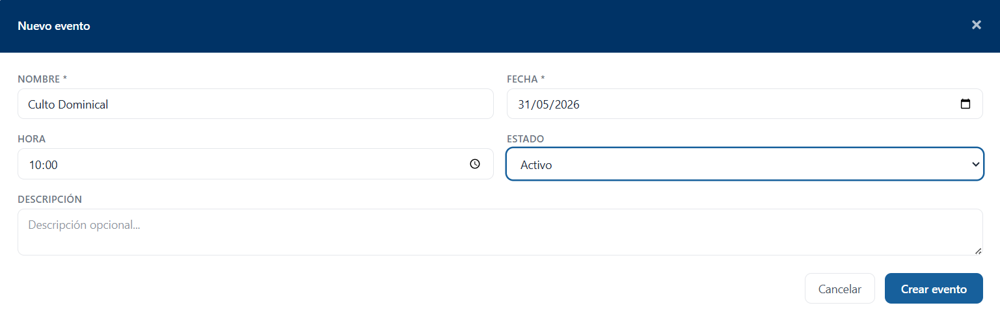
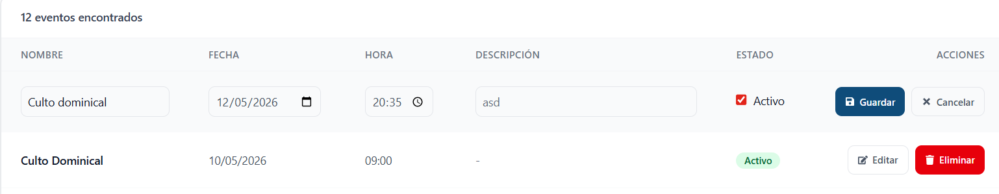

# Eventos

## Descripción

El módulo Eventos permite crear, consultar, modificar y administrar los eventos registrados en el sistema SCRCR.

## Funcionalidades Principales

* Consultar eventos registrados.
* Buscar eventos por nombre.
* Filtrar eventos por fecha.
* Filtrar eventos por estado.
* Registrar nuevos eventos.
* Editar eventos existentes.
* Eliminar eventos.

## Uso del módulo

1. Utilice los filtros de búsqueda para localizar eventos específicos.
2. Seleccione el rango de fechas deseado para limitar los resultados.
3. Presione el botón **Nuevo evento** para registrar una nueva actividad.
4. Utilice la opción **Editar** para modificar un evento existente.
5. Utilice la opción **Eliminar** para remover eventos que ya no sean necesarios.

## Registrar Evento

Para crear un nuevo evento, seleccione la opción **Nuevo evento**.

### Información requerida

* Nombre del evento (*)
* Fecha (*)
* Hora
* Estado
* Descripción

!!! note
Los campos marcados con un asterisco (*) son obligatorios y deben completarse para registrar el evento.

Una vez completada la información, presione **Crear evento**.

## Editar Evento

Para modificar un evento existente, seleccione la opción **Editar** desde el listado principal.

Realice las modificaciones necesarias y presione **Guardar** para actualizar la información.

!!! note
Verifique la fecha, hora y estado del evento antes de guardar los cambios.
