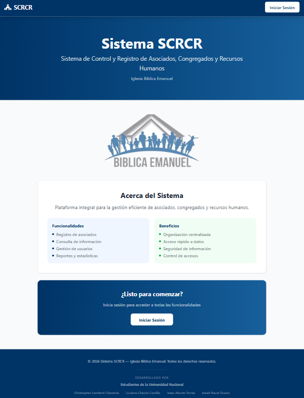

# Guía de Usuario SCRCR

Bienvenido a la guía de usuario del sistema SCRCR (Sistema de Control y Registro de Asociados, Congregados y Recursos Humanos). Esta documentación está diseñada para orientarte en el uso diario de los módulos principales del sistema.

## Estructura de la guía

1. Acceso al Sistema
2. Menú Principal
3. Listado de Asociados
4. Congregados
5. Eventos
6. Gestión de Usuarios
7. Planilla
8. Reportes
9. Permisos
10. Actas
11. Configuración
12. Recomendaciones

## Cómo usar esta guía

1. Selecciona el módulo que deseas consultar desde la navegación lateral.
2. Sigue las instrucciones paso a paso para realizar tareas habituales.
3. Utiliza los ejemplos y las imágenes de referencia para familiarizarte con la interfaz.

## Propósito

- Proporcionar una referencia clara y práctica para usuarios finales.
- Facilitar la operación del sistema sin necesidad de asistencia técnica continua.
- Asegurar una comprensión homogénea de las funciones principales.

> Esta guía está orientada a usuarios finales del SCRCR con responsabilidad en la gestión de asociados, congregados, recursos humanos y reportes.
