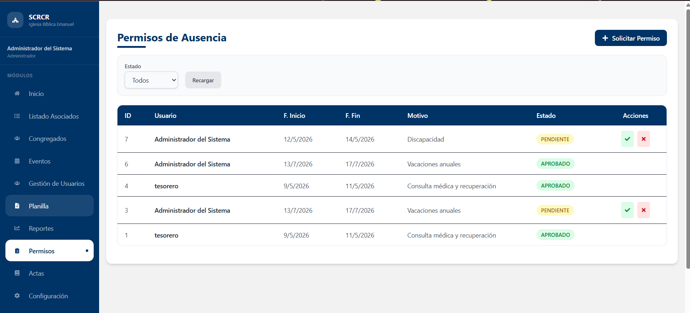
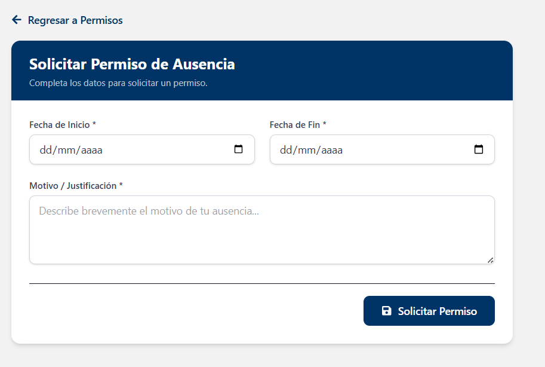

# Permisos

## Descripción

El módulo Permisos permite registrar, consultar y gestionar solicitudes de ausencia realizadas por los usuarios del sistema.

## Funcionalidades Principales

- Consultar solicitudes de permiso.
- Filtrar permisos por estado.
- Registrar nuevas solicitudes de ausencia.
- Aprobar solicitudes pendientes.
- Rechazar solicitudes pendientes.
- Consultar el historial de permisos.

## Estados de una solicitud

Las solicitudes de permiso pueden encontrarse en alguno de los siguientes estados:

- **Pendiente:** La solicitud está en espera de revisión.
- **Aprobado:** La solicitud fue aceptada.
- **Rechazado:** La solicitud fue denegada.

## Uso del módulo

1. Seleccione un estado para filtrar las solicitudes registradas.
2. Presione **Recargar** para actualizar la información.
3. Revise las solicitudes existentes y su estado.
4. Utilice las acciones disponibles para aprobar o rechazar solicitudes pendientes.

## Solicitar Permiso de Ausencia

Para registrar una nueva solicitud, seleccione la opción **Solicitar Permiso**.

### Información requerida

- Fecha de inicio (*)
- Fecha de fin (*)
- Motivo o justificación (*)

!!! note
    Los campos marcados con un asterisco (*) son obligatorios para registrar la solicitud.

Una vez completada la información, presione **Solicitar Permiso** para enviar la solicitud.

## Gestión de Solicitudes

Los usuarios autorizados pueden revisar las solicitudes registradas y realizar las siguientes acciones:

- Aprobar solicitudes pendientes.
- Rechazar solicitudes pendientes.
- Consultar el historial de permisos registrados.

!!! note
    Las acciones disponibles pueden variar según el rol asignado al usuario.