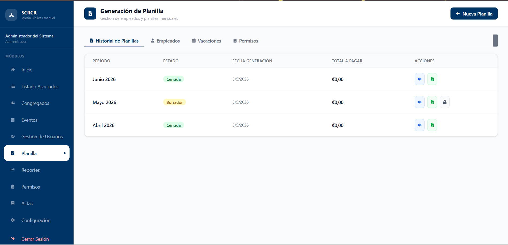
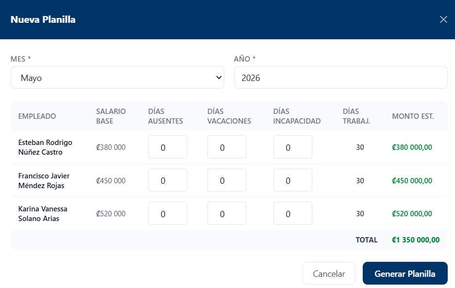
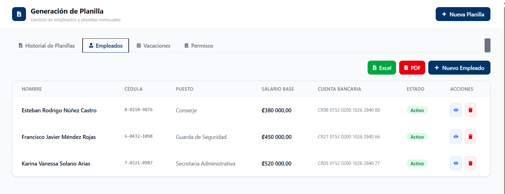
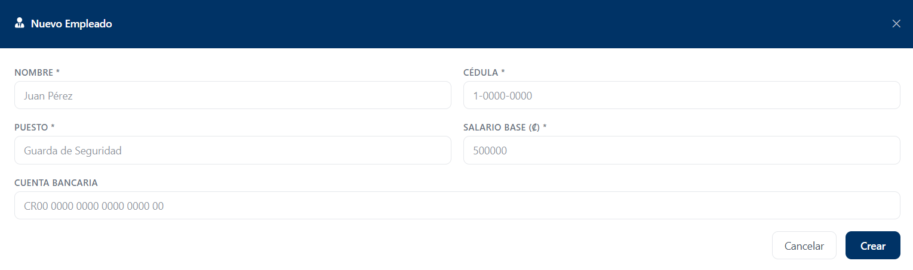
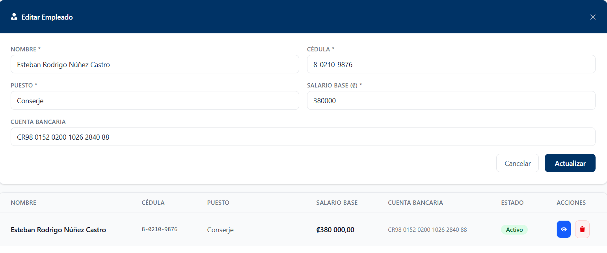
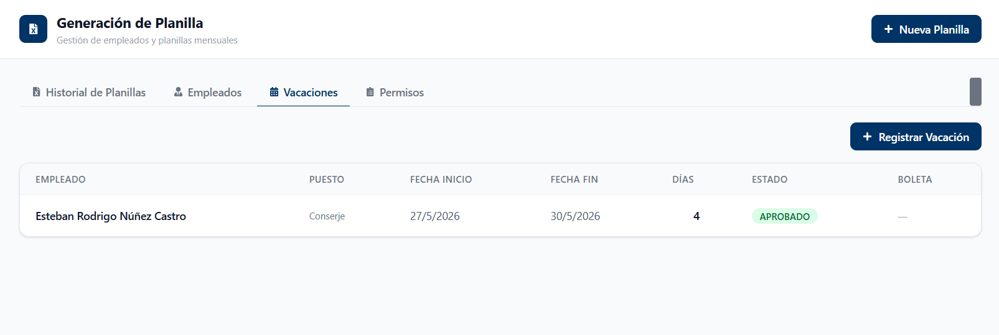
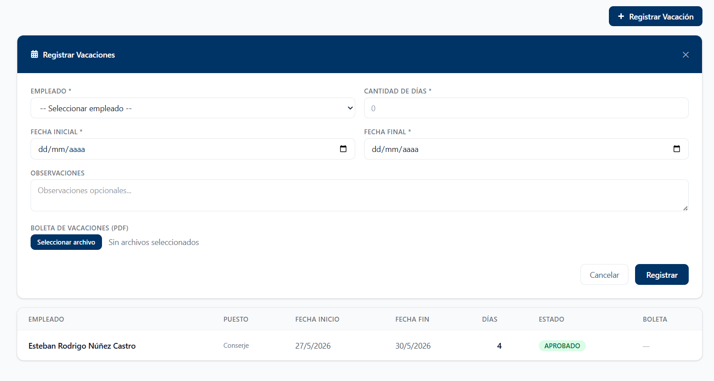
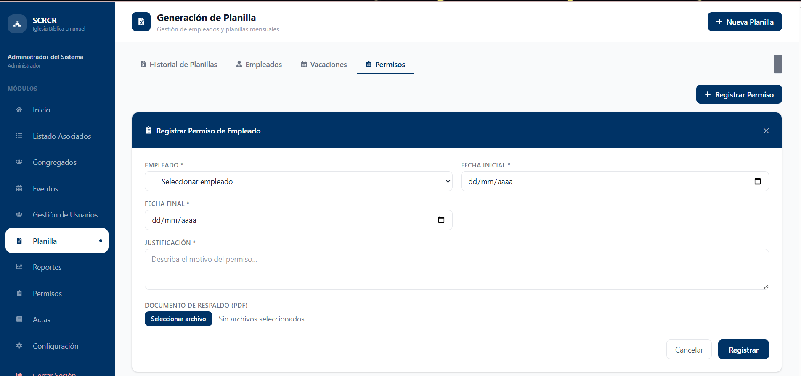

# Planilla

## Descripción

El módulo Planilla permite gestionar la información relacionada con empleados, vacaciones, permisos y la generación de planillas mensuales.

## Funcionalidades Principales

* Generar planillas mensuales.
* Consultar historial de planillas.
* Gestionar empleados.
* Registrar vacaciones.
* Registrar permisos.
* Exportar información.

---

# Historial de Planillas

El sistema permite consultar las planillas generadas anteriormente, su estado y el monto total correspondiente.

## Generar Nueva Planilla

Seleccione la opción **Nueva Planilla** para generar una planilla mensual.

!!! note
Los campos marcados con un asterisco (*) son obligatorios.

---

# Empleados

La pestaña Empleados permite administrar la información del personal registrado.

## Registrar Empleado

Seleccione la opción **Nuevo Empleado**.

Información requerida:

* Nombre (*)
* Cédula (*)
* Puesto (*)
* Salario Base (*)
* Cuenta Bancaria

## Editar Empleado

Para modificar la información de un empleado seleccione la opción correspondiente desde el listado.

---

# Vacaciones

La pestaña Vacaciones permite registrar y consultar solicitudes de vacaciones del personal.

## Registrar Vacaciones

Seleccione la opción **Registrar Vacación**.

Información requerida:

* Empleado (*)
* Cantidad de días (*)
* Fecha inicial (*)
* Fecha final (*)

Opcionalmente puede adjuntarse una boleta de vacaciones en formato PDF.

---

# Permisos

La pestaña Permisos permite registrar permisos solicitados por los empleados.

Información requerida:

* Empleado (*)
* Fecha inicial (*)
* Fecha final (*)
* Justificación (*)

Opcionalmente puede adjuntarse un documento de respaldo en formato PDF.

!!! note
Los campos marcados con un asterisco (*) son obligatorios para completar el registro.
