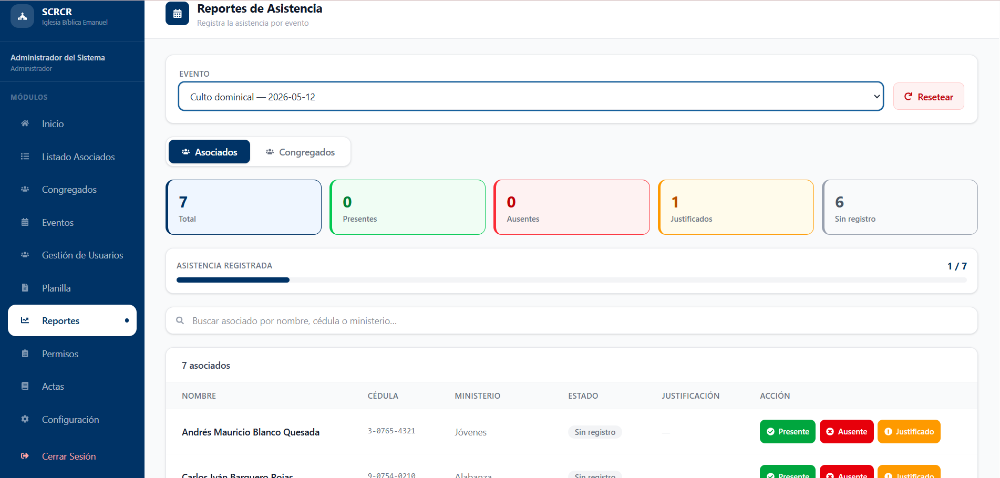

# Reportes

## Descripción

El módulo Reportes permite registrar y consultar la asistencia de asociados y congregados en los eventos registrados dentro del sistema.

## Funcionalidades Principales

- Seleccionar un evento registrado.
- Registrar asistencia de asociados.
- Registrar asistencia de congregados.
- Marcar asistentes como presentes.
- Marcar asistentes como ausentes.
- Registrar ausencias justificadas.
- Consultar estadísticas de asistencia.
- Buscar participantes por nombre, cédula o ministerio.

## Uso del módulo

1. Seleccione el evento correspondiente.
2. Elija la pestaña **Asociados** o **Congregados**.
3. Consulte los indicadores de asistencia mostrados por el sistema.
4. Utilice el buscador para localizar participantes específicos.
5. Registre la asistencia utilizando las opciones disponibles.

### Estados de asistencia

El sistema permite registrar los siguientes estados:

- **Presente:** El participante asistió al evento.
- **Ausente:** El participante no asistió al evento.
- **Justificado:** El participante no asistió, pero presentó una justificación válida.
- **Sin registro:** No se ha registrado asistencia.

## Indicadores mostrados

El sistema presenta estadísticas en tiempo real:

- Total de participantes.
- Cantidad de presentes.
- Cantidad de ausentes.
- Cantidad de justificados.
- Cantidad sin registro.

!!! note
    Los cambios realizados en la asistencia se reflejan automáticamente en los indicadores del evento seleccionado.