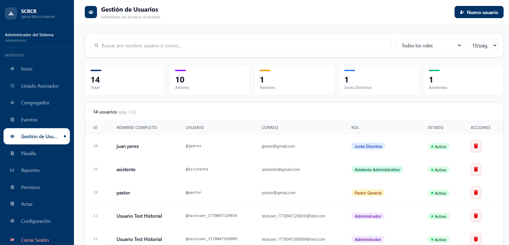
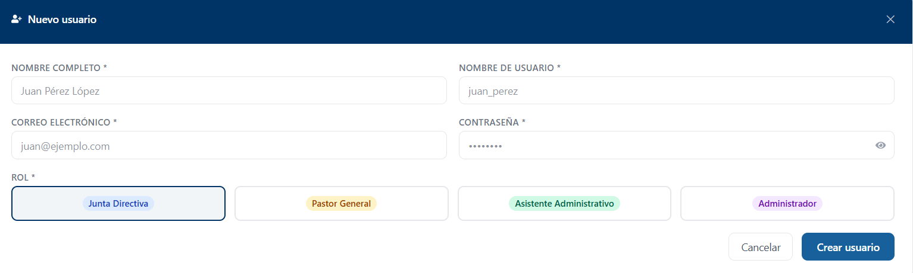

# Gestión de Usuarios

## Descripción

El módulo Gestión de Usuarios permite administrar el acceso al sistema SCRCR mediante la creación y administración de cuentas de usuario.

## Funcionalidades Principales

- Consultar usuarios registrados.
- Buscar usuarios por nombre, usuario o correo electrónico.
- Filtrar usuarios por rol.
- Crear nuevos usuarios.
- Asignar roles existentes a los usuarios.
- Eliminar usuarios.
- Consultar estadísticas generales de usuarios.

## Registrar Usuario

Para crear un nuevo usuario, seleccione la opción **Nuevo usuario**.

### Información requerida

- Nombre completo (*)
- Nombre de usuario (*)
- Correo electrónico (*)
- Contraseña (*)
- Rol (*)

!!! note
    Los campos marcados con un asterisco (*) son obligatorios y deben completarse para crear el usuario.

### Roles Disponibles

Al crear un usuario, se debe seleccionar uno de los roles disponibles en el sistema:

- Administrador
- Pastor General
- Junta Directiva
- Asistente Administrativo

!!! note
    Los roles son definidos por el sistema. Este módulo permite asignarlos a los usuarios, pero no crear nuevos roles.